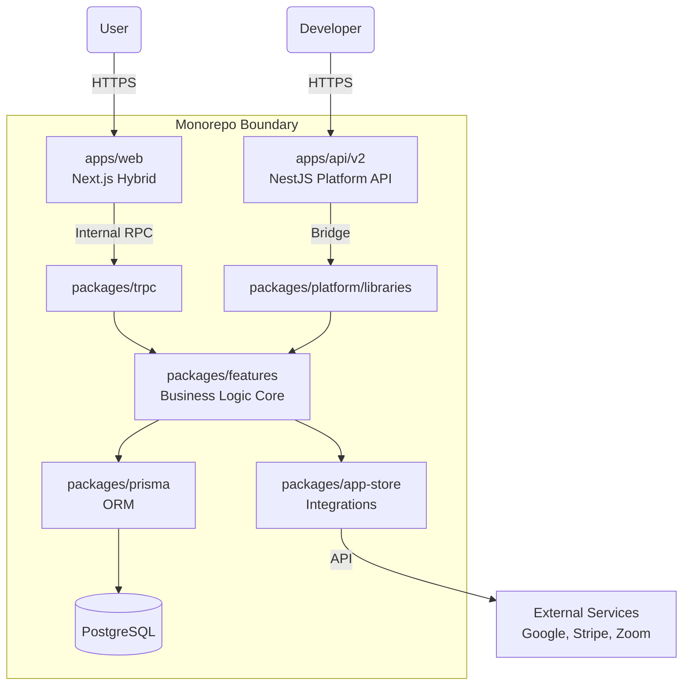
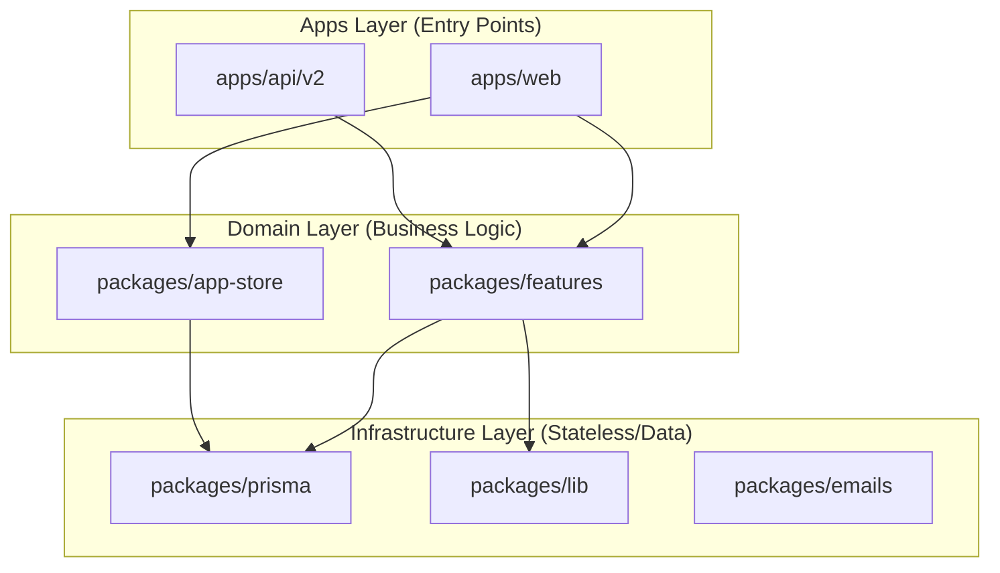

# System Architecture

> **Status**: Verified As-Is
> **Date**: 2026-02-03
> **Scope**: Monorepo Architecture Analysis

## 1. High-Level Architecture
Cal.com utilizes a **Turborepo** monorepo structure implementing a **Hexagonal-ish** architecture.

*   **Core Domain**: Located in `packages/features` and `packages/prisma`. This is the source of truth for business logic and data persistence.
*   **Interfaces (Ports)**:
    *   **Web Interface**: `apps/web` (Next.js Hybrid).
    *   **API Interface**: `apps/api/v2` (NestJS).
    *   **Internal RPC**: `packages/trpc`.
*   **Adapters**:
    *   **App Store**: `packages/app-store` (External Services).
    *   **Emails**: `packages/emails` (Communication).

## 2. Architecture Diagrams

### 2.1 System Context (As-Is)

*Visualizes the high-level flow. Note the "Dual Entry" pattern where both the Web Dashboard and Platform API converge on the shared `packages/features` core.*

### 2.2 Monorepo Dependency Structure

*Illustrates the strict dependency hierarchy. Apps depend on Domain; Domain depends on Infrastructure. Infrastructure never depends on Apps.*

## 3. Component Map

### 3.1 Applications (`apps/`)
| App | Stack | Role | Status |
| :--- | :--- | :--- | :--- |
| **`web`** | Next.js (Pages & App Router) | Main User Interface (Dashboard, Booking). | **TRANSITIONAL** (Migrating to App Router) |
| **`api/v2`** | NestJS | Public Platform API for third-party developers. | **MODERN** |

### 3.2 Core Packages (`packages/`)
| Package | Role | Dependencies |
| :--- | :--- | :--- |
| **`prisma`** | Data Access Layer (ORM). Single Source of Truth for DB Schema. | None (Leaf) |
| **`features`** | **Business Logic Domain**. Contains sub-modules (bookings, schedules). | `prisma`, `lib` |
| **`lib`** | Shared Utilities (Date manipulation, String helpers). | Minimal |
| **`trpc`** | Internal API Router. Bridges `web` to `features`. | `features`, `prisma` |
| **`platform/libraries`** | **Bridge Layer**. Wraps `features` for use by `api/v2` to prevent logic duplication. | `features` |

### 3.3 Ecosystem (`packages/app-store/`)
*   **Architecture**: Plugin-based system.
*   **Structure**: Each app (e.g., `googlecalendar`) is a self-contained module exporting uniform interfaces for `CalendarService` or `PaymentService`.

## 4. Data Flow

### Scenario A: User Booking via Web Dashboard
1.  **Frontend (`apps/web`)** calls `trpc.booking.create`.
2.  **tRPC Router (`packages/trpc`)** validates input.
3.  **Feature Logic (`packages/features/bookings`)** executes:
    *   Checks availability (`packages/features/availability`).
    *   creates DB entry (`packages/prisma`).
4.  **Post-Processing**:
    *   Triggers App Store handlers (e.g., Add to Google Calendar).
    *   Sends emails (`packages/emails`).

### Scenario B: 3rd Party Booking via Platform API
1.  **External Client** calls `POST /v2/bookings` (`apps/api/v2`).
2.  **Controller** calls `PlatformBookingService`.
3.  **Bridge Layer (`@calcom/platform-libraries`)** invokes the *same* logic from `packages/features`.
4.  **Result**: Unified behavior across Web and API.

## 5. Boundaries & Constraints

*   **Dependency Rule**: `apps/*` can import `packages/*`. `packages/features` must NOT import `apps/*`.
*   **Database Access**: strictly via `@calcom/prisma`. Raw SQL is discouraged.
*   **Logic Location**: Business logic must reside in `packages/features`, NOT in Next.js API Routes or React Components.

## 6. Legacy vs Modern Areas

| Area | specific | Status | Action Item |
| :--- | :--- | :--- | :--- |
| **Routing** | `apps/web/pages` | **LEGACY** | New features should use `apps/web/app`. |
| **API** | `apps/web/pages/api` | **LEGACY** | New internal endpoints should use `packages/trpc`. |
| **Fetch** | `axios` / `fetch` in components | **LEGACY** | Use `trpc` hooks (`useQuery`). |
